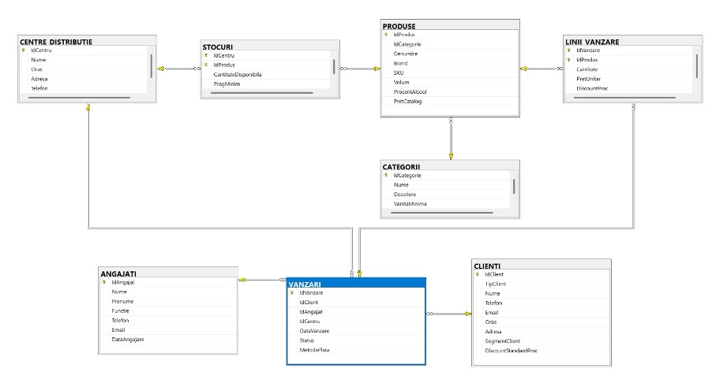
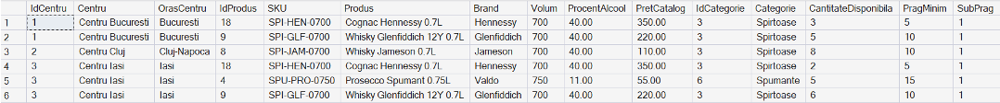
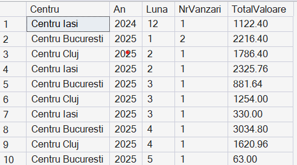

# SQL Server Sales and Inventory Database

This project implements a relational SQL Server database for a beverage distribution company. It models products, categories, customers, employees, distribution centers, sales transactions, and stock levels.

The goal of the project is to combine clean database design with practical reporting and business logic.

## Overview

The database supports:
- product and category management
- stock tracking by distribution center
- sales registration with header and line structure
- customer and employee association for each sale
- reporting for operational and analytical use cases

## Main Components

### Core entities
- Categories
- Products
- Customers
- Employees
- Distribution Centers
- Sales

### Junction tables
- Sales Lines
- Stocks

## Business Logic Included

The project includes:
- primary and foreign key constraints
- validation rules
- default values
- user defined functions
- views
- stored procedures
- analytical queries

### Entity-Relationship Diagram

## Example Questions Answered by the Database

- What is the total sales value by center and month
- Which products are below the minimum stock threshold
- Which clients generated the highest total value
- How are sales distributed by product category
- How do employees perform by number and value of sales

### Products below the minimum stock threshold

### Total sales value by center and month

